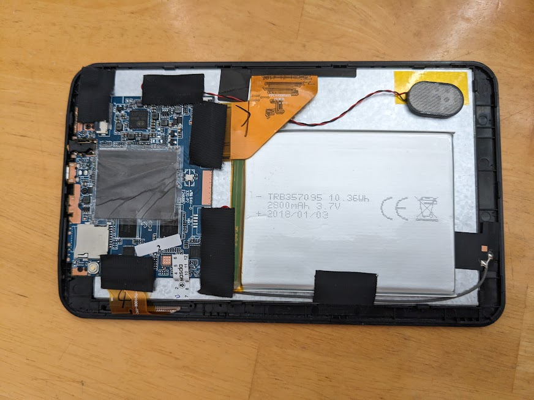
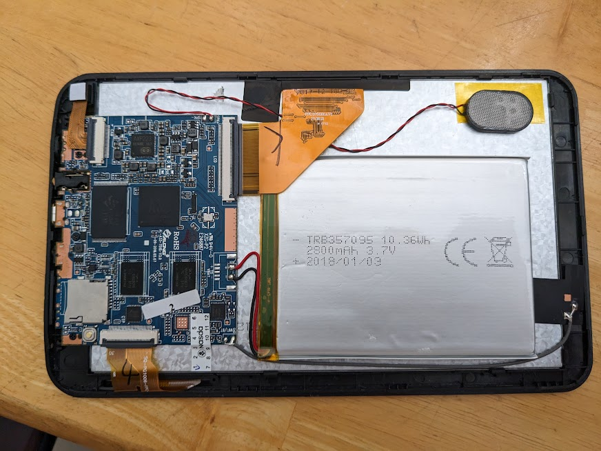
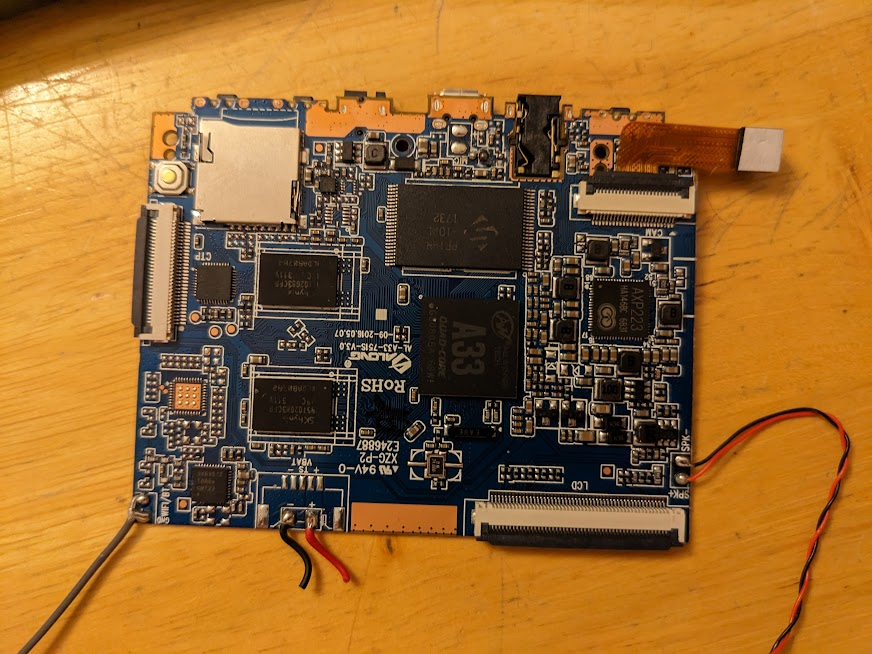
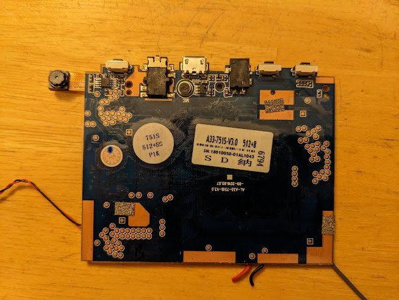
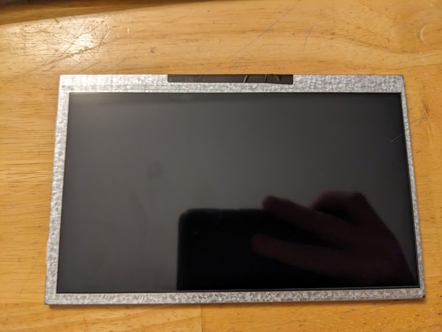
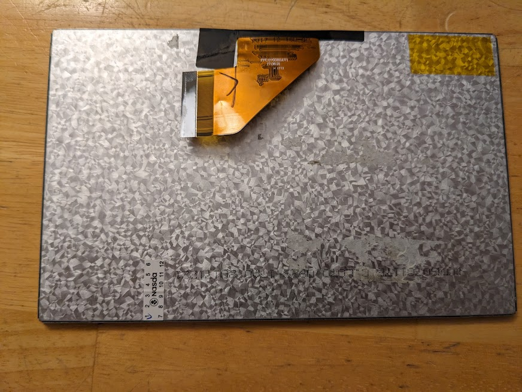
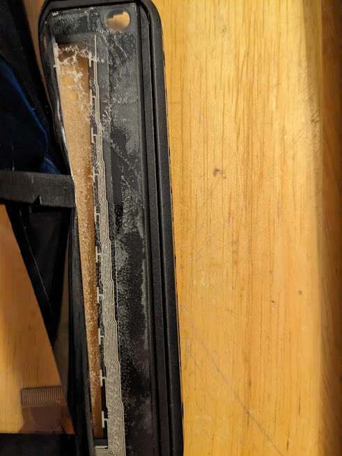

# Device Information & Teardown


## Stock Android Info

Device Codename: `along-6051` (from `build.prop` / adb shell)

From About Device menu:
- Model Number: `A746`
- Build Number: `AZPEN.20170802`
- FCC ID: `2ABKRA727`
- Android Version: `4.4.2`
- Firmware Version: `v2.0`


## From FEL mode:

`sunxi-fel ver`: `AWUSBFEX soc=00001667(A33) 00000001 ver=0001 44 08 scratchpad=00007e00 00000000 00000000`
`sunxi-fel sid`: `0461872a:87185201:9c9747a7:00000000`
`sunxi-fel read 0x01c23800`: `0x0461872a`


## Specs & Hardware Info

General Specs (from manufacturer)
- CPU: Allwinner A33 (1.3 GHz)
- RAM: 512MB
- Storage: 8GB
- Screen 7 inch ~~840x480~~ 1024x600 (manufacturer website states wrong screen resolution)


CPU Details:
- Allwinner A33 SoC chip
- 32-bit `armhf` (`armv7`)
- Quad core Cortex A7
- This is a `sun8i` chip, however, it uses a different dram controller than early `sun8i` (A23). 
- Chip markings: `G8080BA   69W1`
- Uses `AXP223` Power Management IC (PMIC). Chip markings: `HA146BC       6B31`

Memory Details:
- 2x SK Hynix chips: `H5TQ2G83CFR-H9C`
- From [here](https://linux-sunxi.org/DDR3): `DDR3-1333H (supports down binning to DDR3-1066F), x8, density: 2G, page size: 1K `

Storage Details:
- 8GB NAND chip
- Markings
    ```
    PF144
    -IOAL
    1732
    ```
- Also has a "S" logo on it. Not sure what manufacturer / vendor this is.
- I suspect this is a counterfeit / rebinned SK Hynix `H27UCG8T2ETR-BC` (128 G-bit = 8 G-byte). This assumption is based on pictures of Aoson_M751S tablet using this chip on a very similar board. The chip has the same form factor and capacity.

Battery Details:
- Model: `TRB357095`
- Capacity: 10.36 Wh / 2800mAh
- Voltage: 3.7V
- Other text on my model: `2018/01/03`

LCD Panel Details:
- Back of panel is marked `WJSW070117B    C.L070.0929-17A0    20171221`
- The cable that connects to the `LCD` port on the PCB is labeled `FPC.070080AV1`, `17.06.21`, `H 1712`
- This display seems to have been listed as `Display universal 7.0 wjws070080a-fpc v1.0 50 pin` on AliExpress. While I can find online listings for these, specs, datasheets, info are lacking.

Touchscreen Details:
- Silead `GSL1680` chip

GPS Details:
- No GPS in this tablet

Accelerometer Details:
- Uses the `mc32x0` driver / kernel module
- Chip markings:
    ```
    DY7H
    D5D
    ```
- These markings do not match a mCube mc3210, mc3230, or mc3250. Thus, this is probably a "compatible" chip from who knows what manufacturer. 

WiFi Details:
- Android indicates it is using `ssv6200`
- Driver / kernel component seems to be `SSV6XXX_SDIO` and named `SSV WLAN driver`
- Chip markings (note: 'e' on second line is very small):
    ```
    SV6051Z
    TAB6e
    CMT23
    ```

Bluetooth Details:
- None in this tablet

Vibrator Details:
- None in this tablet

Camera Details:
- Camera sensor box has no markings
- Ribbon cable is marked as follows (there is also a KYT logo)
    ```
    KYT-1081-V1.0
    20150908
    SPOA19
    .WD
    ```
- Android dmesg logs reference `sp0a19`, so this is assumed to be the camera module. This is also a loaded kernel module.

Mainboard (PCB) Details:
- Back silkscreen reads:
    ```
    A33-751S-V3.0
    -09-2016.05.07
    ```
- Front sikscreen reads:
    ```
    ALONG
    AL-A33-751S-V3.0
    -09-2016.05.07
    ```
- Large Sticker reads:
    ```
    A33-751S-V3.0    512+8
    SN: 18010050-01AL1043
    ```
- Large sticker also contains the number 6794, the large characters 'S' and 'D' plus some non-latin alphabet symbols.
- Smaller sticker reads
    ```
    751S
    512+8G
    P1K
    ```
- There seems to be a microphone on the back of this board, but it wouldn't be useful in the tablet


## PCB Pictures and Tablet Teardown

*The tablet is disassembled by removing two screws on the side of the tablet with the volume and power keys.*

***WARNING:*** *The battery in this tablet is held to the LCD with two adhesive strips. If attempting to remove the battery you must not bend or puncture the battery. This is difficult due to the nature of the adhesive. It is possible isopropyl alcohol could weaken the adhesive or that heat would weaken it. This is not tested. My recommendation is to safely dispose of any battery removed from this tablet and not attempt to use it again.*




















Development configuration (power via 5V barrel jack or USB port):

TODO: Pictures when done (uart???)


PCB Annotated Images

TODO: Both sides


## Notes

This board is seemingly referred to as `al-a33-751s-v3.0`. There seem to be a few different tablets using it. No stock firmware for it has really been found online from my searching. There are some possible firmwares for older versions (`al-a33-751s-v1.2` or `v1.1`, etc). However, it seems like at least the wifi module was changed for v3 so these firmware files won't work properly at least (if they work at all).

Fun fact: The name for this device (`along-6051`) seems to be due to a company going by along producing (only) these a33-751s boards. The v3 board uses a wifi chip marked `sv6051z`. Thus I think the name comes from `company-wifimodule` format.

Similar devices:

This [Aoson_M751s](https://linux-sunxi.org/Aoson_M751s) uses an almost identical `al-ax3-751b-v1.0` board.

The [Finepower_N1](https://linux-sunxi.org/Finepower_N1) is similar in a lot of ways and may be using an earlier revision of this board.

Several [Q8 Format](https://linux-sunxi.org/Format_Q8#A33_based) A33 tablets may also be similar. This could be a starting point for a device tree. It may just work as is too.

Also seems similar to [Inet_D70_A33](https://linux-sunxi.org/Inet_D70_A33)


List of [A33 Tablets](https://linux-sunxi.org/Category:A33_Tablets)


[FCC ID](https://fccid.io/2ABKRA727) uses name "Dongguan Mingtel Digital Technology". Photos in the exhibits seem to be of an older A23 based tablet, but the name "Azpen" is used.


This device attempts SD card boot before it attempts NAND boot. This is useful for unbricking.
