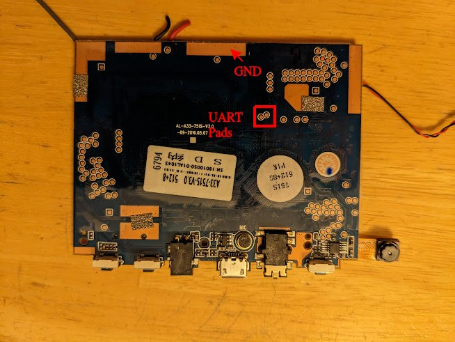
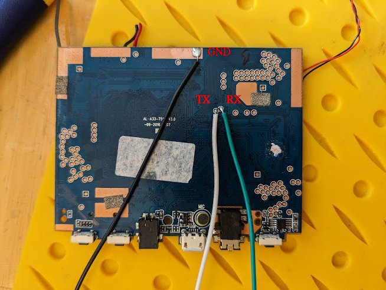
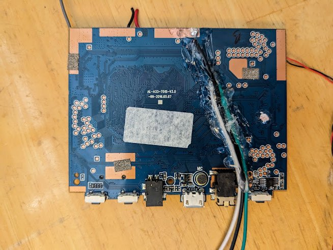

# UART

 

**WARNING:** This is a potentially destructive process and requires appropriate soldering skills and tools.

 

The pcb in this tablet has UART probes that work in custom built u-boot and in custom built kernels (see `LINUX.md`) using `/dev/ttyS0`. I don't believe stock u-boot or android kernel use these at all.

To access, the device must be opened and the PCB unmounted. Lots of tape will need to be removed to do so. **Do not detach the battery if you intend to keep using the device. Detaching the battery risks damage to the battery. It is not recommended to use a battery that has been detached**.

Once the PCB is unmounted, flip it over (on top of the battery). There will be a plastic cover over the back. Part of this needs to be removed. If you remove all of it, make sure to put some insulator (electrical tape) over the board before any attempted re-assembly (although note that re-assembly after adding UART wires will be difficult because of the wires).

UART pads are shown below. TX and RX are from the A33 (board's) perspective. These get crossed to the receiver (receiver / USB-UART convert RX to PCB TX and vice versa).

On the board shown above, I did not intend to re-assemble. Thus, I did not preserve the plastic cover or re-apply it. Instead, I strain relieved the wires using hot glue.

If you want to try re-assembly, make sure to cover the exposed wire leads or test pads on the PCB. The board sits against the metal back of the LCD panel, so things could short. You'd also probably need to use very small wire (even then, I'm not sure it's possible to re-assemble with uart wires attached).
